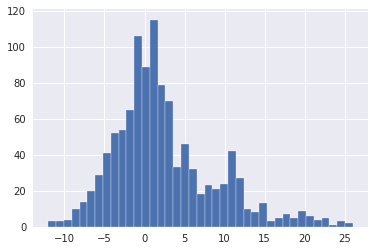
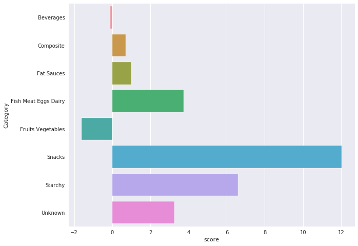

---
# Feel free to add content and custom Front Matter to this file.
# To modify the layout, see https://jekyllrb.com/docs/themes/#overriding-theme-defaults

layout: page
bigimg: /img/path.jpg
---

# Nutrition and Ecology, are they mutually exclusive?
Food is a very controversial subject. 
While taste is relative, the ecological impact of each aliment is not.
This project aims to shed some light to the relationship between nutritional value and ecological impact.
Do we need to choose between those goals?
To respond to our question, we worked with the [Open Food Facts](https://fr.openfoodfacts.org/ "Open Food Facts Web Page") dataset, which lists food products from all over the world, along with many interesting fields such as their manufacturing places, macronutrients or even packaging.

---

## Nutrition Score
How do we know how "healthy" an aliment is?
There are so many conceptions about health and food, that it is probably impossible to come up with an universal response.
We didn't dare create a nutritional scale out of thin air, so we chose to use the [Nutri-Score](/nutri-score) system.
This ranking system uses simple food characteristics such as their energy, fat, sugar and sodium per 100g in order to decide how many "points" each aliment has.
The more points one product has, the least healthy it is considered.

### Nutri-Score Visualisation
First of all, we want to know what the distribution os scores looks like:

**todo** add letters ranking and comment the plots

We decided to take a look at the mean score of different food categories such as beverages or snacks in order to get a feeling of their respective "health tendencies".

**todo** comment the plots

